评估工具：

混淆矩阵：用于评估分类模型性能

- N×N的矩阵（N为类别数量）
- **行**代表真实类别，**列**代表预测类别
- **对角线元素**表示正确分类的样本数量，**非对角线元素**表示错误分类的样本数量

**标准化混淆矩阵**/**归一化混淆矩阵**

- **按行标准化**（最常用）：将每一行的每个元素都除以该行的总和（即实际该类别的总样本数）——**对角线上的值表示的是召回率**
  - 召回率：实际为某类的样本中被正确预测的比例
- **按列标准化**：将每一列的每个元素都除以该列的总和（即模型预测为该类别的总样本数）——**对角线上的值表示的是精确率**
  - 精确率：预测为某类的样本中实际就是该类的比例

**`batch_size`（批大小/批次大小）**：模型在**一次训练迭代（iteration）** 中同时处理的样本数量

**不平衡的多分类数据集**：一个数据集中包含多个类别（超过两个），但这些类别的样本数量分布极不均衡。有些类别包含大量的样本（称为**多数类**），而其他类别只包含很少的样本（称为**少数类**）。

- 问题：模型训练的目标通常是**最小化整体错误率**。在不平衡数据集上，如果模型把所有样本都预测为数量最多的那个类别，就能获得很高的准确率，与需求不符。——**模型偏见**（倾向于学习多数类的特征，而忽略少数类）、**评估指标误导**（高准确率可能是一种假象）


## 矩阵乘法


## Transformer 

​	Transformer是一种基于自注意力机制的深度学习模型。

### 整体架构

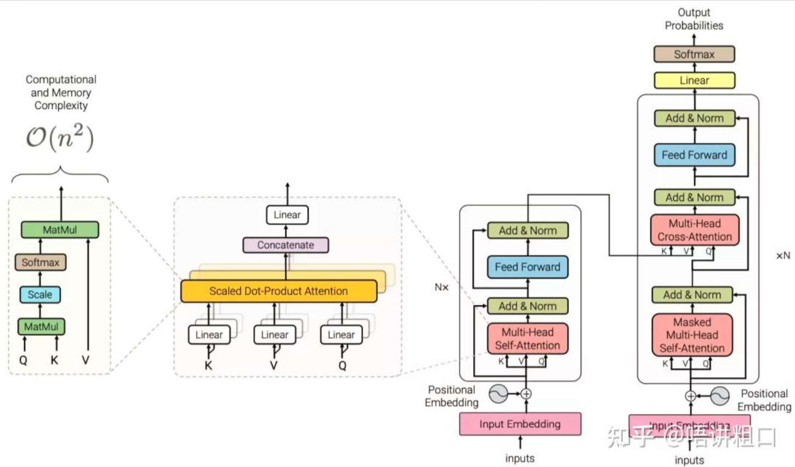


### Transformer模型的类型：

**纯编码器**：（任务是序列-特征向量）将文本输入序列转换为富数字表示的形式——BERT及其变体（掩码语言模型）、适用于文本分类或命名实体识别等任务

- 此架构中给定词元计算出来的表示取决于左侧（词元之前）和右侧（词元之后）上下文。**（双向注意力）**——**预测被遮盖的词** (完形填空)，可以使用**左右两侧**的全部上下文
- “富数字表示”：将文本转换为高维数值向量的方式，以捕捉更多的语义、结构和上下文信息。“富”指的是信息的丰富性和表达能力，而“数字“指的是向量(数值)表示。

**纯解码器**：（任务是预测下一个单词）针对像“谢谢你的午餐，我有一个……”的文本提示，模型将通过迭代预测最可能的下一个词来自动完成这个序列——GPT模型家族

- 对于给定词元计算出来的表示仅依赖于左侧的上下文——**预测下一个词** (自回归)、只能使用**当前词之前**的上下文

**编码器-解码器**：用于对一个文本序列到另一个文本序列的复杂映射进行建模——机器翻译和摘要任务、Transformer架构


### 模型细节

==输入的到底是词元还是普通文本==

#### Inputs 

​	普通文本

--------------------------------------------------------------

#### Input Embedding

##### ① 词元化（分词、Tokenization）——>文本分割成词元

- 输入：**原始文本字符串**
- 输出：**词元列表（符号）或ID列表**
- 步骤：
  - ① 将文本分割成词元，添加特殊Token。`["[CLS]", "The", "cat", "sat", "on", "the", "mat", ".", "[SEP]"]`（单词词元化）
    - 添加特殊Token令牌：开始`[CLS]`、结束`[SEP]`、`[MASK] `等特殊标记
  - ② 为每个词元分配一个唯一的ID（建立词汇表）`{"the": 1, "cat": 2, "sat": 3, "on": 4, "mat": 5, ".": 6}`（一般会统一大小写）——分配ID是为了后续的索引操作
  - ③ 句子被转换成ID序列`Input_IDs`：`[1, 2, 3, 4, 1, 5, 6]`

_____________________

注1：**词元化的尺寸**

① **字符词元化**：忽略文本结构，将整个字符串视为字符流，有助于处理拼写错误和生僻字，缺点是语言结构（如单词）需要从数据中学习。

② **单词词元化**——保留文本某些结构的简单直接的方法

​	将文本细分为单词，每个单词映射到一个整数。——优点：使模型跳过从字符学习单词的步骤，从而降低训练过程的复杂度。

- **子词词元化**：需要先在一个大型语料库上运行BPE等算法，**“学习”出如何合并字符以形成子词的规则，并生成一个词汇表**。这个步骤独立于模型训练。
- **字符词元化**：跳过了显性的规则学习步骤，**直接将最基础的单元（字符）交给模型，让模型在训练过程中自行探索和发现这些字符组合成词、成句的规律**。

③ **单词词元化方法：使用空格分隔文本**

问题：（1）未考虑标点；（2）单词可以包括变形、派生或拼写错误，导致词表太大、神经网络需要大量的参数。

解决方法：只取语料库中最常见的100000个单词，丢弃罕见单词避免词表过大。词表之外的单词统一归类为“unknown”（未知，UNK），映射到一个共用的UNK词元——缺点：可能丢失很重要的信息，模型无法获得与UNK关联的单词信息。

__________________________________________

注2：**`Input_IDs`转换为独热向量one-hot vector的二维张量**（高维、稀疏的“硬编码”）——词嵌入的底层原理、实践中直接利用嵌入层整数索引获取密集向量

- **独热向量（稀疏嵌入）**：将索引转换为向量，一行只有一个1，其他都是0。
- 需要独热编码的原因：
  - 问题：
    - ① ID是孤立的整数，无法表达任何语义信息；向量中，语义相近的词在向量空间中的位置会彼此接近。 将每个词元映射到唯一的ID——给词元引入**虚假的顺序关系**，导致神经网络学习到错误的模式和关系；
    - ② 关系是虚假的，对两个ID进行加减没有意义。
    - ③  ID是孤立的整数，无法表达任何语义信息；向量中，语义相近的词在向量空间中的位置会彼此接近。
  - 解决方法：为每个词元创建一个新列，在该类别为true时分配为1，否则分配为0。每行是一个独热向量。
- 独热编码的问题：
  - 维度过高，过于稀疏：容纳3000个汉字就需要3000×3000的映射表，容纳5000个汉字则需要5000×5000的映射表。过于稀疏，是指向量中太多元素为0，没有意义。
  - 不能体现出“距离”信息：如果两个字之间的意思相近，那两个对应的向量求“距离”时，应该更相近。
  - 没有数学或逻辑关系：不能能满足——国王-男人+女人=女王。

___________________

**② 词(元)嵌入**（Token向量化、Word Embedding、密集嵌入）——>**将一个词（或其独热编码表示）通过一个可学习的权重矩阵映射到一个低维、稠密的数值向量**

- 输入：**词元ID列表**

- 输出：**包含语义信息的向量序列**

- **Embedding模型**(一个神经网络)根据**特定数据集**训练生成**嵌入矩阵**

  - **嵌入矩阵**：模型训练完成后就固定存在，是被所有句子共享的查找表。

  - Embedding模型：动态和静态
    - **静态模型（如Word2Vec）**：一个词无论出现在何种上下文，其向量表示（即嵌入矩阵中对应的行）固定不变。

    - **动态/上下文模型（如BERT）**：将嵌入矩阵提供的初始词向量，再经过多层Transformer网络处理，最终输出的向量会随上下文变化，能处理一词多义。

- 步骤：
  - ① 有一个**嵌入矩阵**（也称查找表）：嵌入矩阵大小`(词汇表大小V, 嵌入维度D)`
    - 词汇表大小 (V)：token的总数
    - 嵌入维度 (D)：每个token被映射到的连续向量空间的维度（如BERT-base常用768维）
  - ② 对于每个句子，模型通过**查找**嵌入矩阵（**ID索引**），将ID序列 `[1, 2, 3, 4, 1, 5, 6]`转换成一个向量序列：`[[0.1, 0.2, 0.3], [1.0, 0.5, 0.0], [0.8, 0.1, -0.2], ...]`

- **词嵌入的优点**：通过训练，语义相近的词（如“猫”和“狗”）在嵌入空间中的向量会彼此接近，从而能够捕捉到词语之间的语义和语法关系。

  

特征向量

_____________

#### Positional Encoding(位置编码)

**加入位置编码的原因？**

​	当嵌入向量未加入位置编码时，模型(编码层)存在**丢失词元的位置信息**的问题。——自注意力机制将句子视为**无序的词语集合**（而不是一个有序的序列），本身不关心输入顺序，因此需要**显式注入**位置信息。（只关心有哪些词，不关心顺序，“狗追猫” 和 “猫追狗” 对模型来说**没有区别**）

- 原因：自注意力机制的核心是计算词与词之间的相关性（注意力分数），这个计算过程只依赖于词本身的语义向量（Query和Key的点积），**完全不考虑它们处在句子的哪个位置**。

**位置编码的方法**

==① **可学习的位置嵌入**方法：与仅使用词元嵌入的方式完全相同，但是使用位置索引作为输入，而不是词元ID。——**位置嵌入矩阵**，大小是 `[最大序列长度, 模型隐藏层维度]`，矩阵的每一行代表一个特定位置的编码向量。==

② 绝对位置表示：由调制正弦和余弦信号组成的静态模式来编码词元的位置。——适用于没有大量数据可用时

- 正弦位置编码公式：

  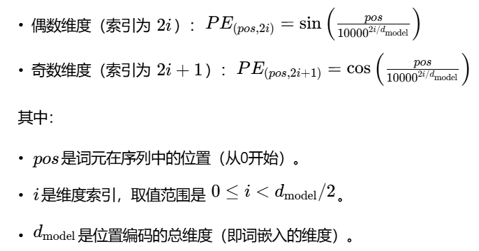

③ 相对位置表示：侧重于建模词与词之间的相对距离（如“我”和“你”之间相隔3个词）——处理长文本时效果更好


词向量+位置编码：执行加法操作，形成带位置信息的向量序列。


________________________


1. 单个句子或文本被表示为一个序列矩阵，其形状为：

```
(序列长度,词向量维度)=(L,d)
```

1. 如果输入是 **批量数据（batch）**，有 N个句子，则输入的形状是：

```
批量形状:(N,L,d)
```

其中 N 是批量大小，L 是每个句子的序列长度，d 是词向量的维度。

______________________


#### 编码器

- 输入：**包含语义和位置信息的向量序列**

- 输出：**具备上下文信息的向量序列**——融合了整个输入序列中所有相关词的信息

- ==作用：**代表单个词元的、相对“孤立”的初始向量**——>**具备上下文信息的向量序列**==
  
- 编码器由许多**编码器层堆叠**而成。
  - 编码器堆叠的目的：通过多层处理，为每个词的初始嵌入表示注入并整合丰富的上下文信息，根据词所在的具体语境动态确定语义。
  - 例如，如果单词“苹果”附近的单词是“主题演讲”或“电话”，那么该单词将被更新为更像“公司”的特性，而不是更像“水果”的特性。

- 编码器的工作模式：
  - **传统的单项编码模式**
    - 编码器一次性读取并处理整个输入文本（问题和历史对话，将所有信息压缩成一个**固定的上下文向量**。然后解码器开始工作，逐词生成回答。在整个生成过程中，编码器提供的这个初始信息包是**固定不变**的。
      - **传统单向编码模式**下，不会在生成过程中再去关注或整合新产生的对话内容。
    - 缺点：生成长回答时，解码器在后期可能会“忘记”或无法有效访问编码器在前期提供的某些关键信息。
  - **双向协作模式**——编码器与解码器之间**持续对话**
    - 解码器在生成每一个词后，会将当前的生成状态（已生成部分的隐藏状态）作为反馈信号送回给编码器。编码器接收到反馈后，会重新评估输入文本，并**调整其注意力焦点**，然后为解码器生成下一步所需的新颖、更具针对性的上下文信息。
    - 能更好地处理长序列和复杂语境。

- 利用注意力机制

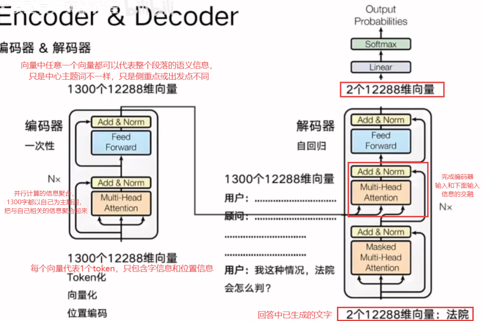


_______________

#### 解码器

- 输入：① 编码器的输出 ② 

- 输出：**每个时间步的词表概率分布**（下一个词是词表中每个词元的可能性）
  - 时间步：序列数据中一个词元/token的位置或序号

- 重要结构：掩码多头自注意力层、编码器-解码器注意力（交叉注意力）层

  - 掩码多头自注意力：**确保生成过程的自回归特性**，即模型在预测下一个词时，只能“看到”以及使用它之前已经生成的词的信息，而不能“偷看”未来的词。（利用**因果掩码 Causal Mask** 实现）
  - 编码器-解码器注意力：让解码器在生成当前词时，能够有选择地**关注输入序列中最相关的部分**
    - **Query** 来自解码器上一层的输出（即经过掩码自注意力处理后的目标序列表示）
    - **Key 和 Value** 来自编码器的最终输出（即对源序列的完整理解）
    - 解码器会用它的Query向量，和编码器输出的**每一个**Key向量计算相似度（点积），得到**注意力分数**（代表与编码器中的key的关联程度）

- 样例：英文“I love you”翻译成法文“Je t'aime”

  ① **初始输入**：解码器接收到编码器对“I love you”的处理结果，以及一个表示开始的特殊符号`<START>`

  ② **生成“Je”**：解码器基于`<START>`和编码器输出，计算出第一个词应该是“Je”的概率最高；将“Je”作为新的输入的一部分。

  ③ **生成“t'”**：解码器的输入是`<START>, Je`和编码器输出——解码器会**并行**处理整个序列，接收 `<START>嵌入向量 + 位置向量`和 `V_Je嵌入向量 + 位置向量`作为输入

  - 掩码自注意力层：模型只能看到`<START>`和“Je”，看不到后面的内容——生成2×2的下三角矩阵
    - 使用因果掩码：对于 `Je`（位置1），它只能与位置0（`<START>`）和位置1（它自己）计算注意力，而不能“看到”位置2及之后的信息。
  - 交叉注意力层：
    - ①计算注意力权重——找焦点： 解码器会用掩码自注意力层的输出（Query向量），和编码器输出的**每一个**Key向量计算相似度（点积），得到一组**注意力分数**，分别代表表Query与“I”、“love”、“you”几个词的关联程度，**Softmax函数**进行归一化后得到权重`[0.1, 0.05, 0.85]`，发现“you”的权重最大、最重要。  
    - ② 生成上下文向量——合成关键信息：利用注意力权重，对编码器输出的**所有**Value向量进行**加权求和**：最终的上下文向量 = 0.1×*V*~I~+0.05×*V*~love~+0.85×*V~you~*
  - 最终模型输出“t'”。

- Decoder  Only结构(只有解码器)：prompt和回答存储在一起，中间用特殊token作为分隔符。（prompt+用户最新问题+已输出的部分内容，都是已有的文字。Decoder  Only结构没有真正意义上的问题和回答，只是完成基于所有已有的文字去生成下一个文字）

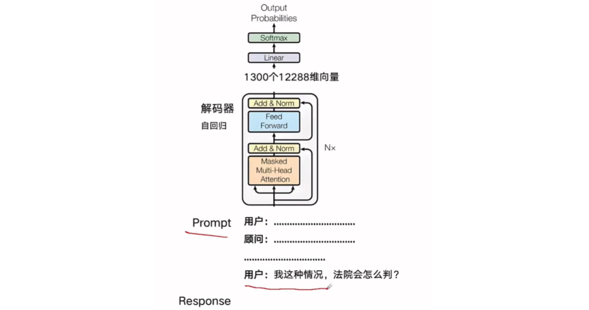


----------

#### Add & Norm(残差连接和层归一化)

输出：输出 = LayerNorm(输入 + 子层(输入))

**残差连接 (Add)**：将子层（如自注意力层）的**输入**与**输出**直接相加

- 作用：缓解深层网络的**梯度消失**和**网络退化**问题
  - **缓解梯度消失**：在反向传播计算梯度时，梯度可以直接通过这条“捷径”回传，避免了在多层连续乘法中变得过小（消失）或过大（爆炸）。

**层归一化/层规范化 (Norm)**：对相加后的结果进行**归一化**处理，使均值为0，方差为1。

- 作用：稳定训练过程

- 将层规范化放置在Transformer的编码器或解码器层中的方法（Add和Norm的先后问题）：

  - 后置层规范化：把层规范化置于跳跃连接之后

    - `子层计算 -> 与输入相加（跳跃连接）-> 层规范化`,`Output = LayerNorm(x + Sublayer(x))`。
    - 问题：在深层网络中，未经规范化的子层输出可能数值很大（尤其在前几轮训练权重随机时），导致叠加后的结果分布剧烈变化，使得后续层归一化的输入不稳定，进而导致**梯度大幅波动**（爆炸或消失）。
      - 解决方法：**学习率预热**，让模型先用小步长探索，找到相对稳定的区域后再加快速度。

  - ==前置层规范化（论文中最常见的布局）==：将层规范化置于跳跃连接之前

    - `层规范化 -> 子层计算 -> 与输入相加`,`Output = x + Sublayer(LayerNorm(x))`。
    - 优势：训练期间更加稳定，并且通常不需要任何学习率预热。

    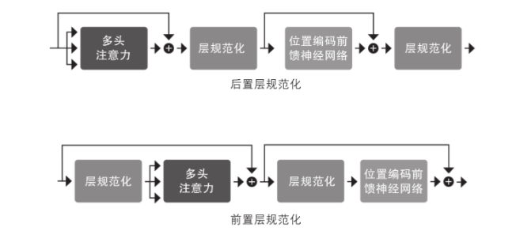


----------

#### Feed Forward（前馈神经网络）

- 作用：对自注意力生成的上下文感知表示进行**非线性变换和增强**


____________________

### 注意力机制 Attention

#### 以RNN为核心的Encoder和Decoder

​	Encoder和Decoder过去都是以循环神经网络RNN为核心计算模块，后来进化为由注意力机制+神经网络组成。

​	循环神经网络RNN其实是模仿人类从左往右、从上往下阅读文字。

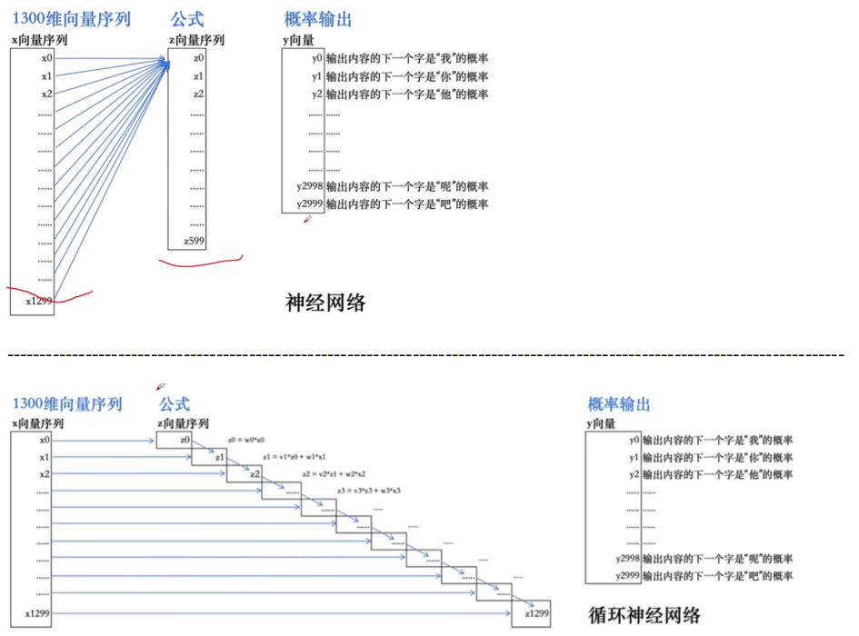

​	过去以RNN为核心的Encoder Decoder具有以下结果重要的问题：

- 信息丢失
- 无法处理较长句子
- 不能并行计算

______________________

#### 注意力机制

​	一种神经网络为序列中的每个元素（**序列中每个词元的嵌入向量**）分配不同权重的机制。把注意力放在重要信息(相关度/权重较高的信息)上，最后输出1个向量。

##### 主要思想

​	不使用固定的嵌入值表示每个词元，而是使用整个序列来计算每个嵌入值的加权平均值。——（通过信息聚合，编码器能够根据当前句子的**上下文**，为每个词生成一个**动态的、上下文相关的表示**）

- 即给定词元嵌入的序列(X~1~,...，X~n~)，注意力机制产生的新嵌入序列为(X~1~',...，X~n~')，每个X~i~'是所有x~j~的线性组合：


​	系数w~ji~称为**注意力权重**(类似于相关度系数)，其被规范化以使得∑~j~w~ji~=1 。

- 例如，单词“flies”会想到昆虫，但“time flies like an arrow”中，会意识到“flies”表示的是动词，因此可以通过以不同的比例结合所有词元嵌入来创建“flies”的表示形式，比如可以给“time”和“arrow”的词元嵌入分配较大的权重w~ji~。——**上下文嵌入**

  |                     | 静态嵌入（如Word2Vec）                                       | 上下文嵌入（如BERT）                                         |
  | ------------------- | ------------------------------------------------------------ | ------------------------------------------------------------ |
  | 表示数量            | 一个词只有**一个**固定的向量表示。                           | 一个词根据其出现的上下文，有**无数个**可能的向量表示。       |
  | 核心机制            | 通过词的共现模式学习一个全局固定的查找表。                   | 通过**自注意力机制**等，动态地融合上下文中所有词的信息来生成当前词的表示。 |
  | **对“flies”的处理** | 无论语境如何，“flies”的向量都是同一个，是“昆虫义”和“动词义”的模糊平均。 | 在“time flies like an arrow”中，生成的“flies”向量**高度倾向于动词含义**。 |


__________________

##### 注意力机制中Q K V的定义和计算

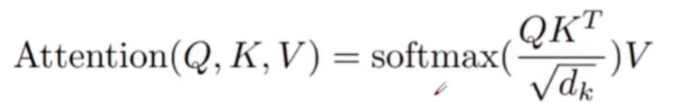

- d~k~：向量维度，模型确定后d~k~是不变的，例如GPT-3的d~k~为12288；
- Q：query，K：key，V：value（K和V一般是键值对）；
- softmax()：计算与Q的相关度系数。

**举例理解**

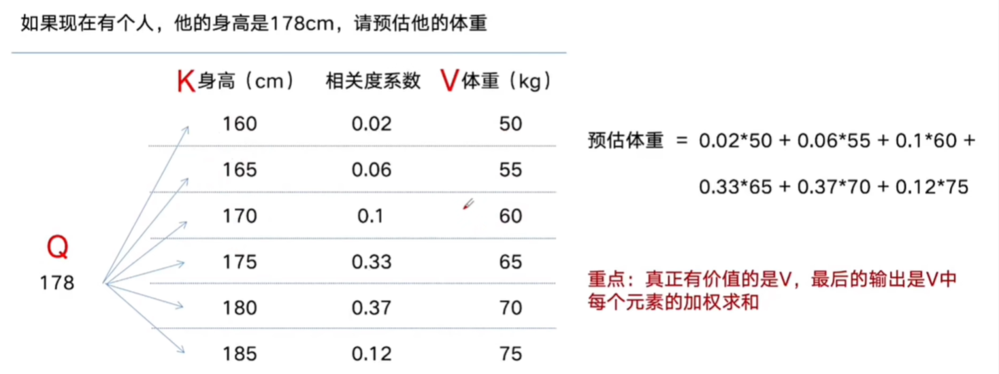

**相关度系数：点积，乘以一个缩放因子，再利用softmax归一化。**

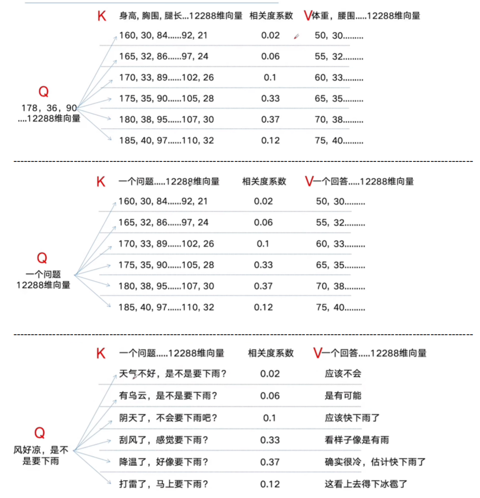

​	**在注意力机制中，真正有价值的是V，最后的输出是V中每个元素和相关度系数的加权求和**

_________

##### 注意力权重的计算方式/步骤——缩放点积注意力

① 将每个词元嵌入投影到三个向量中，分别称为query、key和value； 

- Query(Q)：提出的问题，代表当前词元，表示它**需要**从序列其他部分获取什么信息
- Key(K)：检索的索引，代表每个词元的**身份标识**，用于与Query进行匹配，计算相关性
- Value(V)：返回的内容，包含每个词元**实际的信息内容**，最终被聚合到输出中

② 计算注意力分数：使用相似度函数（即点积**q**⋅**k**=∥**q**∥×∥**k**∥×cos(*θ*)，利用矩阵乘法高效计算）确定query和key向量的相关程度。

- 相似的query和key将具有较大的点积，而那些没有相似处的则几乎没有重叠。——有n个输入词元的序列，对应一个n×n的注意力分数矩阵

③ 计算注意力权重。点积可能产生任意大的数，会导致训练过程不稳定。

- 解决方法：将注意力分数乘以一个缩放因子来规范化它们的方差，再通过softmax进行规范化，以确保所有列的值相加之和为1。

④ 更新词嵌入。得到注意力权重后，将它们与值向量v~1~，…，v~n~相乘，最终获得词嵌入表示


​	**举例**：**2个词元**（比如两个单词）。模型为每个词元生成维度为2的查询（Q）、键（K）和值（V）向量。为了简化，假设所有词元的Q、K、V都相同。

- **查询矩阵 Q**：`[[1, 2], [1, 2]]`，**键矩阵 K**：`[[5, 6], [5, 6]]`，**值矩阵 V**：`[[9, 10], [11, 12]]`，**键向量维度 d~k~**：`2`

  ① 计算点积（注意力分数矩阵）：

  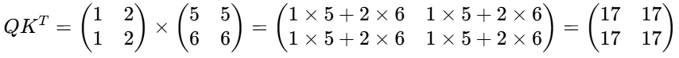

  ② 缩放注意力分数，Softmax计算注意力权重：

  - 缩放注意力分数：注意力分数矩阵除以键向量维度（*d~k~*=2）的平方根，目的是在维度较高时，防止点积结果过大，导致后续Softmax函数的梯度太小。

    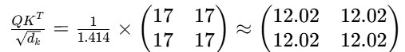

  - Softmax计算注意力权重：对缩放后的分数矩阵的每一行应用Softmax函数，将每一行的数值转换为一个概率分布（所有元素之和为1），使得数值大的元素权重更大，数值小的权重更小。

    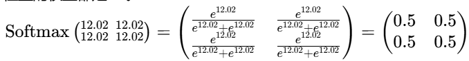

  ③ 计算加权和（输出）：将注意力权重矩阵与值矩阵V相乘

  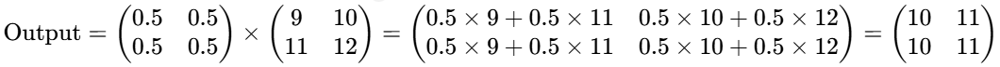

  

- 注意力层的作用：将这些词元嵌入进行混合，以消除歧义，并通过其上下文的内容来丰富每个词元的表示。**注意力层之前的词元嵌入与它们的上下文是独立的。同形异义词（拼写相同但意义不同的词），如前面例子中的“flies”（“飞行”或“苍蝇”），具有相同的表示形式。**
- 注意力机制的过程：两个矩阵乘法（Q×K.T得注意力分数矩阵A，A×V得自注意力机制的最终输出）和一个softmax——一种花哨的平均形式

______

### 自注意力机制 Self-Attention

- 核心目标：信息聚合， K,Q,V中的内容都一样。

- **注意点**：输出不是1个向量，是与输出个数相同的输出向量，维度也与输入向量相同。

- 与**注意力机制**最核心的区别：**查询Q、键K、值V三个向量的来源**

  |              | 注意力机制 (Attention)                                       | 自注意力机制 (Self-Attention)                                |
  | ------------ | ------------------------------------------------------------ | ------------------------------------------------------------ |
  | 核心         | 建立**两个不同序列**之间的关联                               | 建立**同一序列内部元素**之间的关联                           |
  | Q, K, V 来源 | **Q 和 K/V 来源不同**。例如，Q 来自目标序列（Decoder），K、V 来自源序列（Encoder）                                                                                 e.g **对话**：根据你的问题（Q），在百科全书（K/V）中寻找答案 | **Q, K, V 三者同源**，来自同一序列                                              e.g **自我剖析**：阅读一篇文章时，反复思考文中各个观点之间的联系 |
  | 输出/目标 | 输出：一个**对齐向量**，用于在生成目标序列的每个元素时，**聚焦**源序列中的相关信息                                                                          **对齐**：在翻译中，确定当前要生成的目标词应对应源句子中的哪个（些）词 |输出：与输入序列**等长**的、富含上下文信息的向量序列                                                                                   **表征**：为序列中的每个词生成一个融合全局上下文信息的新向量表示|
  | 典型应用     | Transformer **解码器**中的编码器-解码器注意力层              | Transformer **编码器**层，或解码器中的掩码自注意力层         |

- 编码器-解码器注意力**Encoder-Decoder Attention**/交叉注意力层
  - **Query (Q)** 来自**解码器**（即当前正在生成的目标序列）
  - **Key (K) 和 Value (V)** 来自**编码器**的最终输出（即对源序列的深度理解结果）
  - 作用：在解码器生成目标序列的每一个词时，会主动“查询”编码器输出的信息，以确定应该“关注”源序列中的哪些部分。例如，在翻译任务中，生成英文单词 “bank” 时，通过这个机制可以去关注源句中究竟是表示“银行”还是“河岸”的部分，从而实现准确的语义转换。

##### 自注意力机制的原理

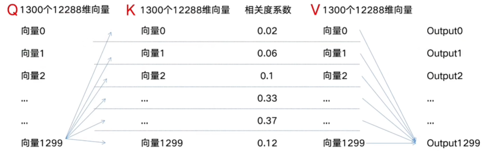

​	Output0/Output1：以向量0/1为中心主题词，把其他向量中与向量0/1相关的信息抓取回来，加权求和到向量0/1身上。最主体的信息来自向量0/1。——得到：包含上下文信息的词元0/1的向量序列

- 计算方式：向量0和K中每个向量都计算相关度系数（点积相似度）。
- 如图，每完成一次信息聚合，需要计算1300×1300次相关度系数，计算复杂度为0(n^2^)。
- 加速：利用向量计算

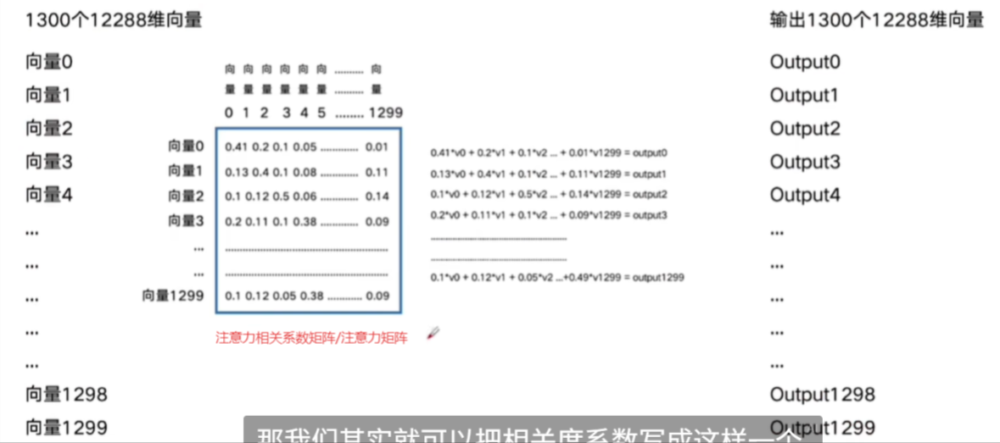


##### **自注意力机制进行信息聚合的问题**

- 整个计算过程没有神经网络，没有任何可学习/调整 的参数——导致无法在自注意力机制中通过调整参数来降低总体误差;
- 比较依赖Embedding向量、位置向量


##### 自注意机制的变形

Z向量：来源于X向量，基于X向量进行某种**线性变换**，突出某些信息，弱化某些信息。

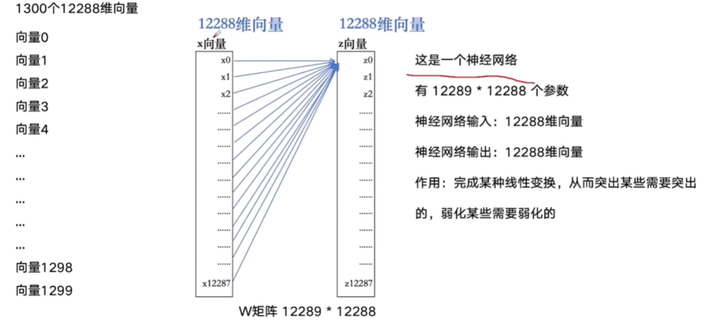

--------------------------------------------------------------------------------------------------

​	通过三个完全不同的、可训练的**权重矩阵 W^Q^, W^K^, W^V^**进行独立的线性变换，使得**Q，K，V不完全一样**

- Q：专注于表达“我需要什么”
- K：专注于表达“我有什么特征”
- V：最终被聚合的精华信息

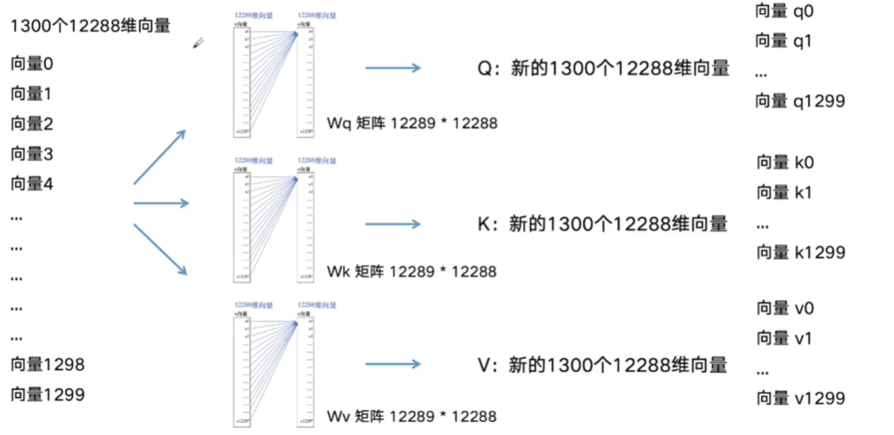

----------------------------------------------------------------------------------------------------

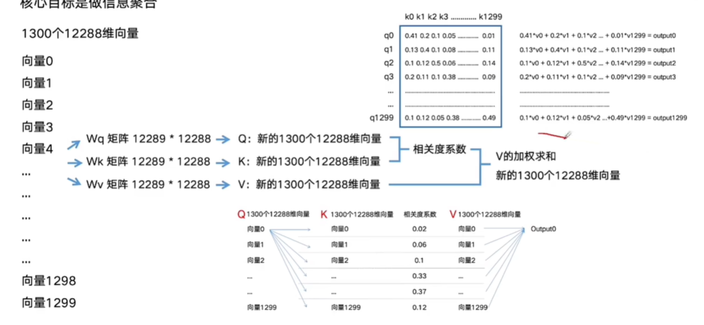


- **为什么要让Q,K,V不同（为什么要基于同一种东西做3种变换）**？

  - 类比：一个高效的图书馆检索系统
    - Q：提出的搜索问题（例如：“什么是注意力机制？”）。
    - K：是书籍的索引标签和关键词（如目录中的“注意力”、“Transformer”）。
    - V： 是书籍中具体的章节内容。

  - 在这个系统中，您的**问题（Q）** 会与图书馆里所有书的**索引（K）** 进行匹配，找到最相关的几本书，然后这些书的**具体内容（V）** 会被聚合起来作为答案给您。如果Q、K、V相同，就相当于您只能用一本书的完整正文同时作为搜索词、索引和答案，这是不合理的。

  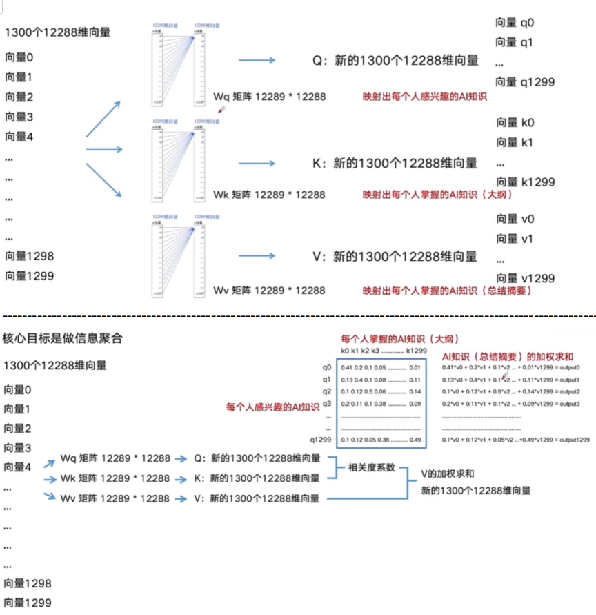

  --------------------------------------------------------------------------------------------------------------------------------------------------------------------

- 经过多层自注意力机制处理后，序列中**第1个到第1300个向量，每一个都是融合了序列中所有其他向量信息的“精华”表示**   

- 结果只要第96轮信息聚合的最后一个向量。（GPT-3中要执行96次注意力机制）

  - **选择最后一个向量是因为其位置**：这个向量在此时已经**聚合了之前所有词元的全部上下文信息**，**代表了截至当前时刻，整个序列的“最终状态”**，最适合用来预测下一个词。

  

  - 模型变大：①向量维度变大； ②模型层数变多

_________

#### 多头自注意力机制 Multi-Head Self-Attention

- 问题：自注意力机制中，多层信息聚合后，Q,K,V中包含的信息越来越多，会出现明明语义相关的两个段落却相关度系数不高的问题。（因为要求越来越高）
  - 解决方法：引入多组Wq，Wk，Wv，同时进行多组Self Attention的聚合计算，最后再整合。（从多个角度提取信息）
  - 为了降低计算量，Wq，Wk，Wv的生成方式变成右侧128维的形式（拆分身）——特征提取，只提取最重要的信息。


---------------------------------------------------------------------------------


--------------------------------------------------------------------------------------------------------------

从多个不同角度进行提取特征，96个角度就是96组、96个头


多个角度的特征聚合的方法：


​	96层是指，信息聚合要做96轮；96头，是指拆分 成96个分身进行与其他向量进行信息聚合，再把96个分身聚合在一起。

- 单纯的拼接会产生一个更高维的向量（例如，8个头拼接后维度是单个头的8倍）。如果直接使用这个高维向量，会使后续层的参数数量暴增，难以训练。因此，Transformer在拼接后立即引入了一个**可学习的线性投影层**（通常记作 W^O^）
  - W^O^矩阵的作用：
    - **降维**：将拼接后的高维向量投影回原始的模型维度（如512维），保持网络中各层维度的一致性，便于残差连接和后续处理
    - **特征融合**：*W^O^*的参数是在训练过程中学习得到的。模型通过数据**自动学习如何给不同注意力头输出的重要性进行加权**，并实现跨头信息的交互与整合。它能够学会诸如“在判断这个词的词性时，来自头A的语法信息比头B的语义信息更重要”这样的规则。

#### 带掩码的多头自注意力机制

- 序列中任一位置仅可关注自身及**之前**的位置（在模型实际生成文本时，它只能基于已经生成的词来预测下一个词。）；
  - 如果在训练时允许模型看到整个目标序列，会造成**训练（能看到答案）和推理（只能自回归生成）之间的严重不一致**，导致模型性能下降。
  - 掩码机制通过在训练阶段就“强制”模型只能依据历史信息进行预测，完美解决“曝光偏差”问题。
- 注意力矩阵的形态：严格的**下三角矩阵**（未来位置权重为0）——**因果掩码矩阵（Causal Mask）**


**如何实现掩码**

​	在计算注意力分数后、进行Softmax归一化之前，模型会将一个**掩码矩阵**与注意力分数矩阵**相加**。掩码矩阵是一个**上三角矩阵**，其未来位置（即矩阵的右上角）的值被设置为一个极大的负数（如 `-1e9`），而当前及过去位置（即矩阵的左下角，包含对角线）的值则为0。

```python
Mask = [[0, -inf],
        [0,   0]]
```

- **Softmax的效果**：通过Softmax函数进行归一化时，那些被设置为极负值的位置（如上例中`<START>`对应`Je`的位置）所得到的**注意力权重会无限趋近于0**。这意味着在计算当前词的表示时，未来词的向量信息将不会被纳入加权求和。

--------


多头注意力：使用自注意力层对每个嵌入应用三个独立的线性变换，以生成query、key和value向量。

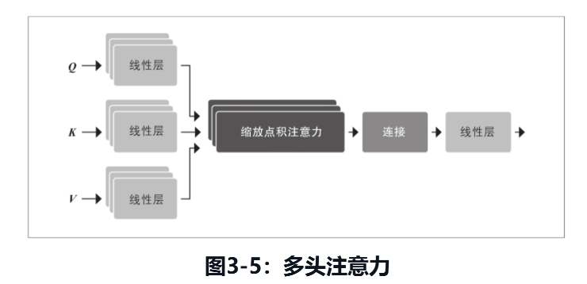

- 这些变换对嵌入进行投影，每个投影都带有其自己的可学习参数，使得自注意力层能够专注于序列的不同语义方面。

- 每组变换代表一种注意力头。拥有多个头能够让模型同时关注多个方面。例如，一个头负责关注主谓交互，而另一个头负责找到附近的形容词。

- 注意力头维度=词向量嵌入维度/注意力头数量

  - 实践中，选择head_dim是embed_dim的因数——将总的嵌入维度（例如768维）平均分配给每个头（例如12个头，每个头64维）的好处：**无论设置多少个头，模型进行一次完整的注意力计算所需要的总计算量是大致不变的**，以便每个头的计算能够保持恒定。

    

    

    ==书中的多头注意力机制没太理解，并且实现方式也没懂！！==

  - 


位置编码前馈神经网络   ==没太懂==

- 前馈层：简单的两层全连接神经网络（1层隐藏层，1层输出层），——与普通全连接网络的不同之处：**对序列中的每个位置进行独立且相同的处理**，不会将整个嵌入序列处理为单个向量。

  

- 


解码器：

- 解码器和编码器的主要区别在于解码器有两个注意力子层。
  - 掩码多头自注意力层：确保在每个时间步生成的词元只基于过去的输出和当前正在预测的词元。
  - 编码器-解码器注意力层：对编码器栈的输出key和value向量执行多头注意力，并以解码器的中间表示作为query。——编码器-解码器注意力层对编码器栈的输出key和value向量执行多头注意力，并以解码器的中间表示作为query


编码器-解码器注意力机制：你（解码器）正在班上，参加一场考试。你的任务是根据前面的单词（解码器输入）来预测下一个单词，听起来很简单，但实际上非常难（你自己试试，预测本书的某一段的下一个单词）。幸运的是，你旁边的同学（编码器）拥有整篇文章。不幸的是，他们是留学生，文章是用他们的母语写的。不过聪明如你，你还是想出了一种作弊的方式。你画了一幅小漫画，描述了你已经拥有的文章内容(query)，交给了你的同学。然后他们会尝试找出哪一段文章与那个描述匹配(key)，并画一幅漫画描述紧随该段文章之后的单词(value)，然后把这个答案传给你。有了这种系统性的帮助，你轻松地通过了考试。


### 为何必须聚合信息

编码器之所以必须进行这种全局的信息聚合，主要为了解决传统序列模型的根本性缺陷，并满足自然语言理解的深层需求：

- **突破循环神经网络的局限**：在Transformer之前，RNN、LSTM等模型处理序列时存在**顺序依赖**，必须逐个处理单词，难以并行计算，效率低下。更重要的是，它们在处理长序列时，早期信息在传递过程中容易衰减或变形，难以有效捕捉**长距离依赖**关系

  。Transformer的编码器通过自注意力机制，允许序列中任意两个位置直接建立连接，无论距离多远，信息都能一步到位，从根本上解决了这个问题

  。

- **构建动态的上下文感知**：传统的词向量是静态的，一个词在任何句子中的表示都相同。而通过信息聚合，编码器能够根据当前句子的**上下文**，为每个词生成一个**动态的、上下文相关的表示**。例如，“银行”一词在“河边有一家银行”和“我去银行存钱”两个句子中，通过聚合不同上下文的信息，会得到截然不同的向量表示，从而准确区分其含义

  。

- **多头注意力捕捉不同关系**：编码器通常采用**多头注意力机制**。这好比一个专家团队协同分析一篇文章，每位专家关注不同的方面：有的分析语法结构，有的关注实体关系，有的则留意情感色彩。通过多个“头”并行地进行信息聚合，模型能够从不同角度、在不同子空间中捕捉词语之间多样化的依赖关系，从而获得更丰富、更精细的语义理解


## Transformer模型的主要架构

Transformer模型有三种主要的架构：编码器、解码器和编码器-解码器

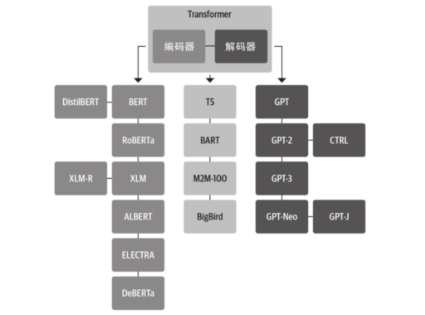

纯编码器模型：NLU任务，如文本分类、命名实体识别和问答

解码器模型：预测序列中下一个单词


传统监督学习：需要大量已见类别的标注数据——识别训练过的已见类别（这些类别再训练数据中存在）

零样本学习（Zero-Shot Learning, ZSL）：让模型能够识别在训练过程中**从未见过**的类别。仅使用已见类别的数据——识别未训练过的**未见类别**（这些类别再训练数据中不存在）

零样本迁移或零样本学习：通常指在一个标注集上训练模型，然后在另一个标注集上进行评估。


## 数据集

PAN-X （WikiANN）：多种语言的维基百科文章，标注实体类型：LOC（地点）、PER（人物）、ORG（组织），标注格式IOB2 格式——多语言命名实体识别（NER）的评估与模型训练

- **IOB2格式**：一个句子中的每个词都会被赋予一个标签，以指示它是否属于某个命名实体以及它在该实体中的位置。B-前缀表示实体的开头，位于之后的属于同一实体的连续词元则赋予I-前缀。O标记表示该词元不属于任何实体。

**数据格式示例**：句子 `"Jeff Dean is a computer scientist at Google in California"`

被标注为：

- `Jeff`-> `B-PER`（人名的开始）
- `Dean`-> `I-PER`（人名的中间部分）
- `Google`-> `B-ORG`（组织名的开始）
- `California`-> `B-LOC`（地名的开始）
- 其他非实体词汇则标记为 `O`。

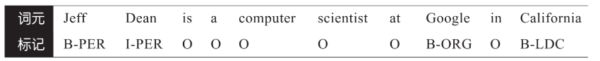


多语言词元化技术

词元分析器pipeline的步骤：规范化、词元化预处理、词元化模型、后处理

规范化： ① 去除空格和移除重音符号； ②字符串全部转为小写字母

jack sparrow loves new york!

词元化预处理：将文本拆分为单词

["jack"，"sparrow"，"loves"，"new"，"york"，"!"]

词元化模型：将单词拆分成更小的子词，以减小词表的大小，并尝试减少无法识别的词元数量——此时拥有的不再是字符串列表，而是整数列表（即输入ID）

[jack，spa，rrow，loves，new，york，!]

- 常见的子词拆分算法包括BPE、Unigram和WordPiece等

后处理：对词元列表进行一些额外的转换。例如，在输入的词元索引序列的开头或结尾添加特殊词元，添加分类和分隔符词元

[CLS，jack，spa，rrow，loves，new，york，!，SEP]——这是整数序列，而不是这里看到的字符串序列
